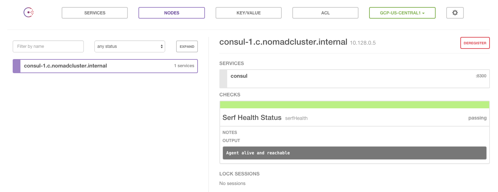

# Create A Nomad Cluster On GCP with Terraform

This is a demo project that will create a [Nomad Cluster][nomad] on **[Google Clould Platform][gCloud]** with **[Terraform][terraform]**.

**Google Cloud Platform** enables developers to build, test and deploy applications on Google’s highly-scalable and reliable infrastructure.

**Terraform** is a tool for creating, combining, and managing infrastructure resources across multiple providers. Manage resources on cloud providers such as Amazon Web Services, Google Cloud, Microsoft Azure, DNS records on DNSSimple, Dyn, and CloudFlare, email services on Mailgun, and more.

**Nomad** is a cluster manager and scheduler designed for microservices and batch workloads. Nomad is distributed, highly available, and scales to thousands of nodes spanning multiple datacenters and regions.

## Install Terraform

If terraform is not installed on the workstation, following the instructions on [Installing Terraform][installing-terraform] to install Terraform.

**Tip:** for MacOS users, just `brew install terraform`

## Setup A Google Cloud Project

The start point for working on Google Clould Platform is **Project** (very engineering oriented).

The first thing we need to do is to login and create a new project at [Google Project Console][gProject], for example:

Project Name | Project ID
------------ | ----------
NomadCluster | nomadcluster


**Note:** you'll be asked to setup billing infomation for this new project. If you are new user, Google gives you a `$300.00` GCP credit for 60 days. 

### Enable Google Cloud APIs for NomadCluster

To use and control google cloud with command line tools, we need to enable Google Cloud APIs.

Go to [Google Cloud API Manager][gAPI]
and enable Google Cloud APIs for NomadCluster:

* Compute Engine API
* Cloud Storage Service
* Cloud Deployment Manager API
* Cloud DNS API
* Cloud Monitoring API
* Cloud Storage JSON API
* Compute Engine Instance Group Manager API
* Compute Engine Instance Groups API
* Prediction API

**Note:** Make sure the project is *NomadCluster* and click through the APIs to enable them.

### Get Authentication JSON File

Authenticating with Google Cloud services requires a JSON file which is called the _account file_ in Terraform.

This file is downloaded directly from the [Google Project Console][gProject]:

1. Click the menu button in the top left corner, and navigate to "Permissions", then "Service accounts", and finally "Create service account".

1. Provide **nomadcluster** as the name and ID in the corresponding fields, select "Furnish a new private key", and select "JSON" as the key type.

1. Clicking "Create" will download your credentials.

1. Rename the downloaded json file to **account.json**

## Provision NomadCluster on Google Cloud
```shell
$ git clone https://github.com/xuwang/gcp-nomad.git
$ cp account.json gcp-nomad/tf/
$ cd gcp-nomad/tf
```
**Note:** You should check default values defined in **tf/variables.tf** and make modification to match your own case, e.g. use your own **`google_project_id`** instead of the default _`nomadcluster`_.

### Plan and apply the Terraform managed resources

Run Terraform plan to preview what resources will be created:

```shell
$ terraform plan
...
module.worker.google_compute_instance.node.1: Creation complete
module.worker.google_compute_instance.node.2: Creation complete
module.worker.google_compute_instance.node.0: Creation complete
Apply complete! Resources: 26 added, 0 changed, 0 destroyed.
...
Outputs:
  consul_private_ips   = 10.128.0.5
  consul_public_ips    = 104.197.15.176
  consul_service_ip    = 104.154.93.78
  etcd_initial_cluster = etcd-1=http://10.128.0.2:2380
  etcd_private_ips     = 10.128.0.2
  etcd_public_ips      = 104.197.187.59
  nomad_private_ips    = 10.128.0.4,10.128.0.3,10.128.0.6
  nomad_public_ips     = 130.211.175.44,104.197.46.94,104.197.24.239
  worker_private_ips   = 10.128.0.8,10.128.0.7,10.128.0.9
  worker_public_ips    = 104.197.239.164,104.197.92.33,104.197.104.97
```
If everything looks good, apply the terraform:

```shell
$ terraform apply
...
Apply complete! Resources: 8 added, 0 changed, 0 destroyed.
...
Outputs:
   nomad_service_ip = 146.148.104.177
```
Give a few minutes, the NomadCluster should be up and running on google cloud.

## Demo

### Login and check out the Nomad Cluster
If you have [gcloud][gCloud] installed:

```shell
$ gcloud --project=nomadcluster compute ssh nomad-1
```

Or simply login to one of nomad server from [GCP Console] (https://console.cloud.google.com/compute/instances?project=nomadcluster) by click the **SSH** link on the nomad-1 instance:

```shell
demo@nomad-1 ~ $ nomad server-members
Name                                         Addr        Port  Status  Proto  Build  DC   Region
nomad-1.c.nomadcluster.internal.us-central1  10.128.0.4  4648  alive   2      0.2.3  GCP  us-central1
nomad-2.c.nomadcluster.internal.us-central1  10.128.0.3  4648  alive   2      0.2.3  GCP  us-central1
nomad-3.c.nomadcluster.internal.us-central1  10.128.0.6  4648  alive   2      0.2.3  GCP  us-central1

demo@nomad-1 ~ $ nomad node-status
ID                                DC   Name                              Class   Drain  Status
worker-1.c.nomadcluster.internal  GCP  worker-1.c.nomadcluster.internal  <none>  false  ready
worker-2.c.nomadcluster.internal  GCP  worker-2.c.nomadcluster.internal  <none>  false  ready
worker-3.c.nomadcluster.internal  GCP  worker-3.c.nomadcluster.internal  <none>  false  ready
```
### Check out the Consul Cluster

Open browser on http://< nomad_service_ip>



## Cleanup: Destroy the NomadCluster

If you want to **stop paying google** for NomadCluster, remember to clean it up:

```shell
$ terraform destroy
...Do you really want to destroy?
  Terraform will delete all your managed infrastructure.
  There is no undo. Only 'yes' will be accepted to confirm.

  Enter a value: yes

null_resource.etcd_discovery_url: Refreshing state... (ID: 2224559004314873638)
template_file.etcd_cloud_config: Refreshing state... 
...
...
null_resource.etcd_discovery_url: Destroying...
null_resource.etcd_discovery_url: Destruction complete
google_compute_disk.data: Destruction complete

Apply complete! Resources: 0 added, 0 changed, 30 destroyed.
```
**Verify everything is destroyed on [GCP Console] (https://console.cloud.google.com/compute/instances?project=nomadcluster)**

[virtualbox]: https://www.virtualbox.org/
[vagrant]: https://www.vagrantup.com/downloads.html
[CoreOS]: https://coreos.com/
[using-coreos]: http://coreos.com/docs/using-coreos/
[Etcd]: https://coreos.com/etcd/
[Docker-Nodeapp]: https://github.com/xueshanf/Docker-Nodeapp
[terraform]: https://www.terraform.io/
[installing-terraform]: https://www.terraform.io/intro/getting-started/install.html
[gCloud]: https://cloud.google.com/
[gProject]: https://console.cloud.google.com/project
[gSDK]: https://cloud.google.com/sdk/
[gAPI]: https://console.cloud.google.com/apis
[gcloud-lb]: https://cloud.google.com/compute/docs/load-balancing/network/example
[gInstance]: https://console.cloud.google.com/compute/instances
[nomad]: https://www.hashicorp.com/blog/nomad.html
